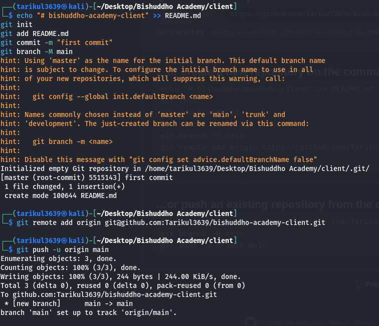

# 📌 Git Setup & Push Workflow (Step by Step)

---

## 1. Create README file
```bash
touch README.md
```

---

## 2. Initialize Git repository
```bash
git init
```

---

## 3. Add files to staging
```bash
git add .
```

---

## 4. First commit
```bash
git commit -m "initial commit"
```

---

## 5. Setup SSH (One-time)

Generate SSH key:
```bash
ssh-keygen -t ed25519 -C "your_email@gmail.com"
```

Start SSH agent:
```bash
eval "$(ssh-agent -s)"
ssh-add ~/.ssh/id_ed25519
```

Show public key:
```bash
cat ~/.ssh/id_ed25519.pub
```

👉 Then add this key to GitHub:
https://github.com/settings/keys

---

## 6. Check remote origin
```bash
git remote -v
```

---

## 📸 Demo Screenshot (Git Push Errors Example)

A real project demo is shown here:



---

## 7. If remote exists, remove it
```bash
git remote remove origin
```

---

## 8. Add SSH remote
```bash
git remote add origin git@github.com:USERNAME/REPO_NAME.git
```

---

## 9. Push to GitHub (first time)
```bash
git branch -M main
git push -u origin main
```

---

## 📌 Final Workflow Summary
```bash
touch README.md
git init
git add .
git commit -m "initial commit"

git remote remove origin   # if needed
git remote add origin git@github.com:USERNAME/REPO_NAME.git

git branch -M main
git push -u origin main
```